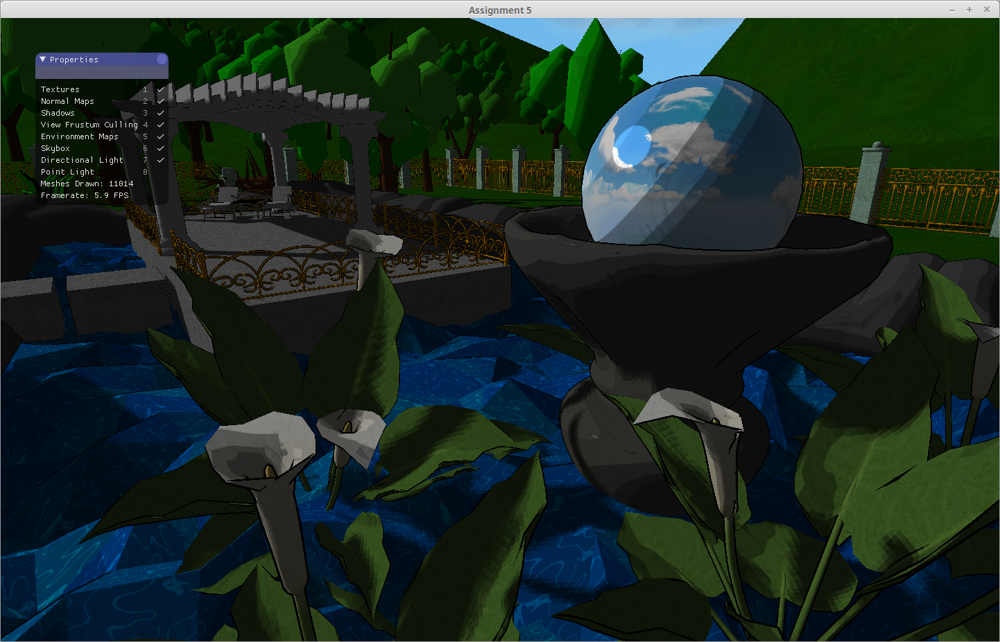

# CS488-A5
Final project for CS488. Implemented various graphics techniques including directional and point lighting, shadows, view frustum culling and environment maps. Developed using C++ and OpenGL.

